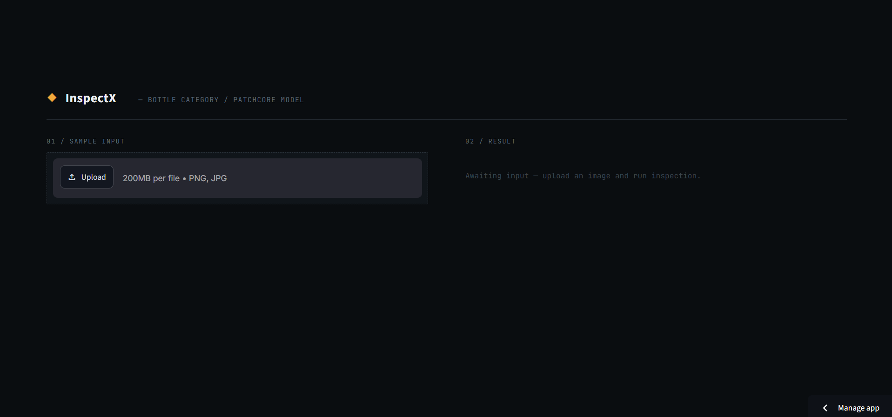
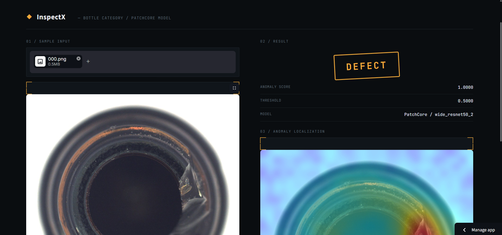
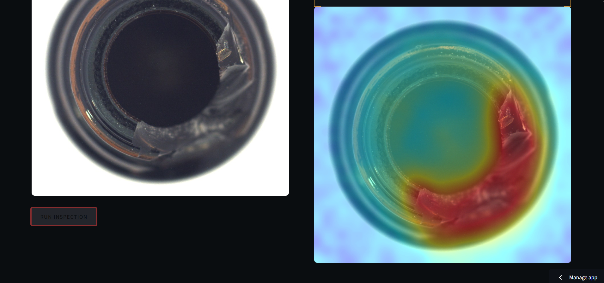

# ◆ InspectX — Industrial Visual Defect Detection

A visual quality-control system that spots defects in product images — trained and tested on the MVTec AD benchmark (bottle category). It learns what a normal, defect-free product looks like, then flags anything that doesn't match. No labeled defect images needed for training.

**Live Demo:** https://inspectx.streamlit.app/

**Sample Test Images:** [Download a few test images](sha256:0fbce12f01a377f19020487d6ad1c70add0b3f01c9d08448de60131e6b9572df) (mix of good and defective bottles) to try on the live demo.

> Runs on Streamlit Community Cloud's free tier, so it sleeps after a bit of inactivity. First load after that might take a few extra seconds while it spins back up.

<p align="center">
  
</p>

---

## The problem

Checking every product by eye doesn't scale, and in most factories, defective items are rare — you mostly just have piles of *good* photos, not labeled examples of every possible defect. So instead of training a classifier on "defective vs. not," this project treats it as an anomaly-detection problem: learn the normal pattern from good images only, then measure how far a new image deviates from that.

Dataset: [MVTec AD](https://www.mvtec.com/company/research/datasets/mvtec-ad), from MVTec Software GmbH — this is the benchmark most industrial anomaly-detection papers actually test against. Working with the **bottle** category here: 209 clean training images, and a test set that mixes good bottles with broken_large, broken_small, and contamination defects.

---

## How this actually got built

1. **`src/train_autoencoder.py` + `src/evaluate_autoencoder.py`** — First pass: a convolutional autoencoder, trained only on good images, using how badly it reconstructs an image as the anomaly signal. Got **0.62–0.73 ROC-AUC** depending on resolution and loss setup — not great. Turns out this is a known weak spot for reconstruction-based methods: averaging pixel error across the whole image buries the signal from a small, localized scratch or stain.
2. **`src/train_patchcore.py`** — Switched to **PatchCore**, via the [Anomalib](https://github.com/openvinotoolkit/anomalib) library. Instead of training a decoder, it builds a memory bank from a frozen pretrained ResNet's features and flags images whose features sit far from anything in that bank. This is the method from Roth et al.'s 2021 paper, one of the stronger published results on this exact dataset. Jumped to **0.86 AUROC, 0.85 F1** — a real improvement, and it lines up with what the papers already say about feature-based methods beating reconstruction-based ones here.
3. **`api.py` + `dashboard.py`** — the actual usable product: upload an image, get a verdict, see where the anomaly is. `dashboard.py` loads the model directly for the live version; `api.py` wraps the same model as a standalone FastAPI service so it can be called from something other than the dashboard too.

---

## Results

Test set = good + broken_large + broken_small + contamination.

| Metric | Autoencoder (first attempt) | PatchCore (what's live) |
|---|---|---|
| Image AUROC | 0.62–0.73 | **0.86** |
| F1 Score | ~0.46–0.53 | **0.85** |

---

## Where's the defect, exactly?

PatchCore doesn't just say "yes/no" — it hands back a pixel-level anomaly map, so you can actually see which part of the bottle triggered the flag.

<p align="center">
  
</p>

<p align="center">
  
</p>


One thing worth calling out: the heatmap colors are normalized against a **fixed scale**, not each image's own min/max. That matters more than it sounds — if you normalize per image, even a totally clean bottle's tiny natural pixel variation gets stretched to look like a dramatic red-hot anomaly, purely because the normalization always maps *that image's* range to the full color spectrum. With a fixed scale, a good bottle actually looks calm and blue, and red only shows up when the anomaly score is genuinely high.

---

## Where this falls short (no sugarcoating)

- **It has no idea what it doesn't know.** Feed it something that isn't a bottle at all — tried this by accident with an unrelated photo — and it doesn't say "I can't tell," it just produces a meaningless, spread-out heatmap. A real deployment would need some kind of out-of-distribution check before trusting the output.
- **One category only.** This model only knows bottles. MVTec AD has 15 different categories, each with its own idea of "normal," and research on this benchmark shows a single model trying to cover all of them tends to do worse than separate, specialized models per category.
- **Not heavily tuned.** Didn't push hard on PatchCore's hyperparameters (coreset ratio, neighbor count) — 0.86 is a solid first result, not an attempt to match the original paper's benchmark-tuned 99%+ numbers.

---

## What I'd add next

- **A router in front of multiple category models** — a small classifier that first figures out what product it's even looking at, then hands it off to the right category-specific PatchCore model. This mirrors how the anomaly-detection literature actually handles multi-category setups, rather than trying to force one model to learn everything at once.

---

## Stack

- **Modeling:** PyTorch, Anomalib (PatchCore), pretrained wide_resnet50_2 backbone
- **First attempt, kept for the comparison:** a hand-built convolutional autoencoder, SSIM + MSE loss
- **Serving:** FastAPI, as a standalone service (`api.py`)
- **Frontend:** Streamlit, with a custom industrial-QC look — model loaded directly in-process for deployment
- **Deployment:** live on Streamlit Community Cloud. (Tried Render with a Dockerfile first — kept in the repo — but landed on Streamlit Cloud in the end.)

---

## Running it yourself

```bash
git clone https://github.com/aathif-gh/Inspectx-defect-detection.git
cd Inspectx-defect-detection
python -m venv venv
venv\Scripts\activate       # Windows
pip install -r requirements.txt

# Grab MVTec AD (bottle category) and drop it at data/bottle/
# https://www.mvtec.com/company/research/datasets/mvtec-ad

python src/train_patchcore.py   # trains + exports the model, ~15-20 min, one-time

# Option A: just run the dashboard (loads the model directly)
streamlit run dashboard.py

# Option B: run the API standalone, point a client at it separately
uvicorn api:app --reload
```